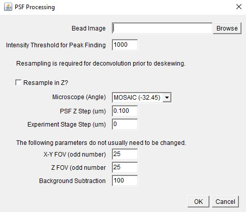

# Point Spread Function for Deconvolution
{: .no_toc }

The [Richardson-Lucy deconvolution](https://en.wikipedia.org/wiki/Richardson%E2%80%93Lucy_deconvolution) performed by the `decon` module requires a centered, cropped, and background subtracted point spread function (PSF). For the original pipeline order (`deskew > decon`), the `decon` function will perform resampling in z to match the PSF to the input images. However, to use the `decon-first` option in the configuration file, the PSF file must be resampled prior to running the pipeline. See [ImageJ Macro](#imagej-macro) to prepare a PSF file for the pipeline.

The PSF is input to the pipeline by including it in the paths portion of the configuration file. The directory containing PSF files is is specified, and then specific file names inside that folder are linked to the laser lines. Any filename is appropriate as long as it is specified, but the laser values themselves must exactly match the `Settings.txt file` (e.g., don't use 561 when it should be 560). There must be a matching settings file for each PSF and it must have a matching name. For example, a PSF file named `cropped_560_PSF.tif` must have a corresponding file  `cropped_560_PSF_Settings.txt`.

## Table of Contents
{: .no_toc .text-delta }

1. TOC
{:toc}

## ImageJ Macro
The input PSF must be centered, and ideally cropped to a square. We provide an [ImageJ macro](https://github.com/aicjanelia/LLSM/blob/master/src/imagej/center-psf.ijm) that will take an image stack and perform this cropping for you. It can also optionally resample the PSF in z to match the input image sampling. To use, run the `center_psf.ijm` macro. A GUI will open, as shown in the figure below.



### Dependencies

- 3D Objects Counter
- Multiview Reconstruction (BigStitcher)

The macro script uses the FIJI plugin _3D Objects Counter_ to determine the bead peak with subpixel accuracy. Centering and cropping rely on _Multiview Reconstruction_. The _Multiview Reconstruction_ tools can be installed by installing the FIJI plugin _BigStitcher_. The _Multiview Reconstruction_ tools are also used to perform optional resampling in z.

The use of _Multiview Reconstruction_ will result in a dataset.xml file as well as some number of .xml~1, .xml~2, etc. files. These files are used during the processing but are not necessary for the downstream pipeline and can be deleted if desired.

### Centering and Cropping

To center the PSF, provide an image of a bead on the first line of the GUI (drag and drop a file, type of the full file path, or hit the browse button). An intensity threshold of 1000 frequently works, but if the macro is not identifying the peak correctly, this parameter can be changed. The images will be processed and a new file with the name cropped_####.tif will be saved where #### indicates the input file name.

### Resampling in Z

To perform resampling in z, select the check box. The following three inputs are only required when the resampling checkbox is selected. Select the appropriate microscope and corresponding objective angle from the dropdown menu and indicate the step size used to acquire the objective-scanned bead image. Finally, indicate the stage step size for the stage-scanned experimental data. When resampling is selected, the macro will first save a centered and cropped PSF, as described above, and then will save a separate cropped_resampled_####.tif file after resampling.

The value input into the stage step size will be multiplied by $$sin(angle)$$ to determine the final z-step size of the output resampled file. If the experimental data was objective scanned, resampling before running the pipeline is not required and **not recommended**. However, if there is a use case for resampling the PSF without multiplying by the objective angle, choose the Objective Scanning option from the microscope dropdown menu. Note that resampling does not change the PSF settings file and that the pipeline assumes that a resampled PSF has the same input spacing as the experimental images regardless of the recorded spacing.

### Additional Parameters

For best results, the PSF should be cropped to a cube after being centered. The size of the final output fil is specified by the FOV values, which must be an odd number to allow the PSF to be centered appropriately. An image of 25 x 25 x 25 voxels works well for deconvolution.  The background subtraction value of 100 is based on the properties of the LLSM and MOSAIC cameras.

## Pipeline: Configuration File
This is an example portion of a configuration file to specify the PSF file locations. The section `laser` is required when the configuration file includes a `decon` section, while the section `resampled` is necessary when the configuration file includes a `decon-first` section.

```json
"paths": {
    "root": "/path/to/experiment/",
    "psf": {
        "dir": "calibration",
        "laser": {
            "560": "cropped_560_PSF.tif",
            "488": "cropped_488_PSF.tif"
        },
        "resampled": {
            "560": "cropped_resampled_560_PSF.tif",
            "488": "cropped_resampled_488_PSF.tif"
        }
    }
}
```

